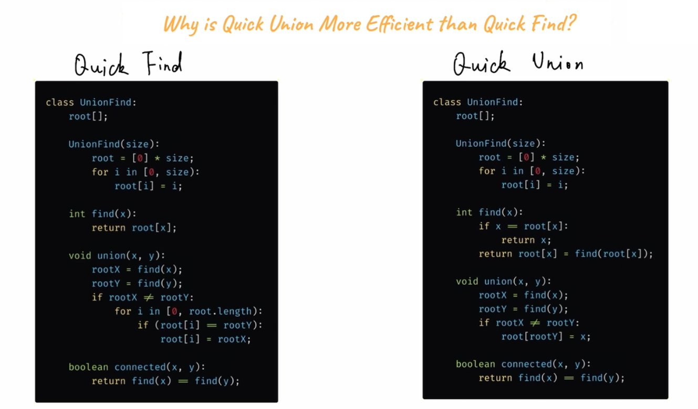

## Common patterns / tricks / coding structures
A 45-min coding session is always stressful. One not only need to be able to come up with the solution, 
but also come up with the solution and **code it fast**. 

Do Note that some question may appear completely irrelevant to the algorithm we are going to use in the first glance.
Such examples are [koko eating bananas](main/koko_eating_bananas.go) for binary search and [doc product of two sparse vectors](main/dot_product_of_two_sparse_vectors.go)
for two pointers with sorted array
 
Practice makes perfect.  
#

### 1. Tree Traversal  
Reference questions:
- [all nodes that have a distance k from the target node](main/all_nodes_distance_k_in_binary_tree.go)
- [floor and ceiling of K in BST](main/floor_and_ceiling_of_k_in_BST.go)
- [full binary tree](main/full_binary_tree.go)
- [invert binary tree](main/invert_binary_tree.go)

#

### 2. Graph 
Reference questions:
- [graph valid tree](main/graph_valid_tree.go)
- [number of connected components in an undirected graph](main/number_of_connected_components_in_undirected_graph.go)
- [the earliest moment when everyone become friends](main/the_earliest_moment_when_everyone_become_friends.go)
- [smallest string with swaps](main/smallest_string_with_swaps.go)
- [evaluate division](main/evaluate_division.go)
- [find the celebrity](main/find_the_celebrity.go)
- [redudant connection](main/redundant_connection.go)

#### 2.1 Disjoint Set (a.k.a UnionFind)
https://leetcode.com/explore/learn/card/graph/618/disjoint-set/3881/

Two flavor or implementations (pseudo code):

Generally speaking, *Quick Union* is better in terms of overall time efficiency. There are two mechanisms to optimize the *Quick Union* approach.
##### 2.1.1 "Union by rank"
Try to balance the tree during `union` function
```
public void union(int x, int y) {
    int rootX = find(x);
    int rootY = find(y);
    if (rootX != rootY) {
        if (rank[rootX] > rank[rootY]) {
            root[rootY] = rootX;
        } else if (rank[rootX] < rank[rootY]) {
            root[rootX] = rootY;
        } else {
            root[rootY] = rootX;
            rank[rootX] += 1;
        }
    }
}
```
##### 2.1.2 "Path compression"
Try to cache(and compress) the path during `find` function. 
```
public int find(int x) {
    if (x == root[x]) {
        return x;
    }
    return root[x] = find(root[x]);
}
```
My golang implementation with above mentioned optimizations: [DisjointSet](utils/disjoint_set.go)

#### 2.2 DFS (using adjacent list)
#### 2.3 BFS (using adjacent list)

#

### 3. Backtrack 
Reference questions:
- [combination sum](main/combination_sum.go)
- [max are of island](main/max_area_of_island.go)
- [number of islands](main/number_of_islands.go)
- [number of provinces](main/number_of_provinces.go)
- [permutations](main/permutations.go)
- [permutations II](main/permutations_ii.go)

#

### 4. Binary search 
Reference questions:
- [koko eating bananas](main/koko_eating_bananas.go)
- [search in rotated sorted array](main/search_in_rotated_sorted_array.go)

#

### 5. Sliding window 
Reference questions:
- [longest substring without repeating characters](main/longest_substring_without_repeating_characters.go)
- [minimum window substring](main/minimum_window_substring.go)

#

### 6. Two pointers 
Reference questions:
- [doc product of two sparse vectors](main/dot_product_of_two_sparse_vectors.go)

#

### 7. Handling intervals
Reference questions:
- [interval list intersections](main/interval_list_intersections.go)
- [meeting room](main/meeting_room_II.go)
- [merge intervals](main/merge_intervals.go)
- [merge list of numbers into ranges](main/merge_list_of_numbers_into_ranges.go)
- [university career fair](main/university_career_fair.go)

#

### 8. Dynamic Programming
Reference questions:

1D DP:

- [maximum subarray](main/maximum_subarray.go)

2D DP:

- [edit distance](main/edit_distance.go)

#

### 9. Prefix Sum
Reference article: https://leetcode.com/problems/path-sum-iii/solution/ 

Basic coding pattern:
```
prefixSum += ..  //calculate current prefixSum
if prefixSum == target //path from beginning
  ....

if prefixSum - target exists, or other criteria //path from somewhere in the middle
  ... 

```

Reference questions:
- [continuous_subarray_sum](main/continuous_subarray_sum.go) //array
- [subarray_sum_equals_k](main/subarray_sum_equals_k.go) //array
- [path_sum_iii](main/path_sum_iii.go) //tree

#

### 10. Combination of data structures
Reference questions:
- [stack with max() function in O(1) time](main/max_stack.go)
- [LRU implementation](main/LRU_cache.go)

#

### XXX Special / TBD
Reference questions:
- [most profit assigning work](main/most_profit_assigning_work.go)
- [robot bounded in circle](main/robot_bounded_in_circle.go)
- [trap rain water](main/trap_rain_water.go)
- [task scheduler](main/task_scheduler.go)